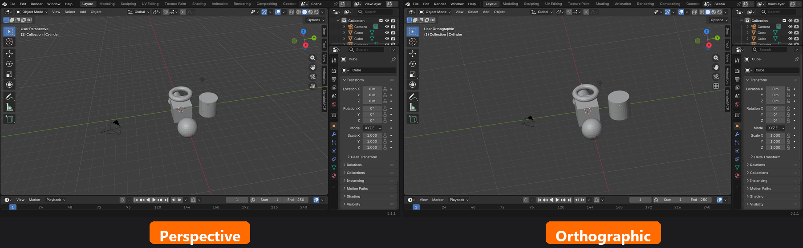

# Lesson 03 HTML Integration: Phase 3 through 4 Handoff

This handoff covers the next integration chat for `lesson_03_navigation_and_viewport_control.html`. Phases 1 and 2 were completed in prior work (Phase 1 inlined 5 SVGs into the-big-three; Phase 2 inlined 1 SVG into mouse-navigation). The HTML now sits at ~158.5 KB. Integration state: 6 of 18 figures placed.

Phases 3 and 4 together place 5 figures (4 inline SVG + 1 PNG) across two sections:

- Phase 3: perspective-ortho (#12 SVG, #13 SVG, #6 PNG)
- Phase 4: standard-views (#7 SVG, #8 SVG)

## Project context

- **Project root:** `\\wsl$\Ubuntu\home\practicalace\projects\blender_course`
- **Target HTML:** `\\wsl$\Ubuntu\home\practicalace\projects\blender_course\lesson_03_navigation_and_viewport_control.html`
- **Progress doc:** `\\wsl$\Ubuntu\home\practicalace\projects\blender_course\lesson_03_integration_progress.md`
- **Status doc:** `\\wsl$\Ubuntu\home\practicalace\projects\blender_course\status.md`
- **Phase 1 handoff (reference):** `\\wsl$\Ubuntu\home\practicalace\projects\blender_course\lesson_03_integration_handoff.md`
- **Phase 2 handoff (reference):** `\\wsl$\Ubuntu\home\practicalace\projects\blender_course\lesson_03_integration_phase2_handoff.md`
- **Images directory:** `\\wsl$\Ubuntu\home\practicalace\projects\blender_course\images\`

All 18 Lesson 03 image assets exist in `images/`. Production is complete; only integration remains.

## Standing rules (unchanged, locked across all phases)

- **WSL path prefix:** `\\wsl$\Ubuntu\` always. Never `\\wsl.localhost\`.
- **Tools:** `Filesystem:edit_file` only for existing files. Always `dryRun=true` first to confirm anchors match, then commit with `dryRun=false`. Verify with `Filesystem:get_file_info` after every commit.
- **Wrapper pattern:** plain `<figure>` plus `<figcaption>`. No class. `styles/main.css` already styles both elements directly.
- **PNG handling:** `` inside the figure.
- **SVG handling:** inline the SVG verbatim inside the figure, re-indented to 20-space content depth. Strip the `color="#222"` attribute from the inline `<svg>` root tag (it locks `currentColor` and breaks dark mode when inlined; standalone `.svg` files keep it). Preserve `xmlns`, `viewBox`, `role`, `aria-labelledby`, `font-family`, and the original `<title>` and `<desc>` elements exactly.
- **Anchors:** 2-3 lines for `oldText`, unique within the file.
- **No new em-dashes** in figcaptions, alt text, or any markdown updates. Em-dashes in pre-existing source HTML or older status entries are preserved.
- **Per-chat archive discipline:** warn Ray when context starts running long.

## Indentation pattern (verified across Lesson 02, Lesson 03 Phase 1, and Lesson 03 Phase 2)

- `<figure>` opens at column 16
- `<svg>` opens at column 20
- Multi-line `<svg>` root tag continuation attrs at column 25
- `<title>` and `<desc>` at column 22
- SVG body elements (`<rect>`, `<text>`, `<g>`, `<line>`, `<ellipse>`, etc.) at column 22
- Children of top-level `<g>` groups at column 24
- `</svg>` at column 20
- `<figcaption>` at column 20
- `</figure>` at column 16

The transformation is mechanical: prepend 20 spaces to every line of the source SVG, drop the `color="#222"` attribute line, reattach the trailing `>` to the `font-family` line above. The container scratchpad at `/home/claude/transform_svg.py` and `/home/claude/inlined/` from the prior chats does this; either reproduce it or compose by hand. (Note: Claude container files reset between chats, so the next chat will need to recreate the transform script or hand-edit. The script is simple: read source SVG, drop the `color="#222">` line, reattach `>` to the previous line, prepend 20 spaces to every line, wrap in `<figure>` plus `<figcaption>`.)

## Phase 3: perspective-ortho (3 figures)

### Figure #12: lesson_03_12_perspective_depth.svg

- **Source:** `\\wsl$\Ubuntu\home\practicalace\projects\blender_course\images\lesson_03_12_perspective_depth.svg`
- **Section:** `perspective-ortho`, subsection "Perspective View: How Eyes See"
- **Insertion point:** After the "train tracks" paragraph (begins "Imagine standing on train tracks..."), before the "When to Use Perspective View" card.
- **Anchor sketch (verify in the HTML):**
  - oldText spans from `<p>Imagine standing on train tracks. The rails appear to converge...` through the closing `</p>` and then `<div class="card" style="background: #e3f2fd; border-left: 4px solid #2196F3;">` with `<h4>💡 When to Use Perspective View</h4>`.
- **Draft figcaption:** "Perspective view borrows the rule your eyes follow: parallel rails appear to bend toward a single vanishing point on the horizon. The further the object, the smaller it looks."

### Figure #13: lesson_03_13_orthographic_parallels.svg

- **Source:** `\\wsl$\Ubuntu\home\practicalace\projects\blender_course\images\lesson_03_13_orthographic_parallels.svg`
- **Section:** `perspective-ortho`, subsection "Orthographic View: Technical Precision"
- **Insertion point:** After the "infinitely good eyes" paragraph (begins "Think of orthographic view as if you had infinitely good eyes..."), before the "When to Use Orthographic View" card.
- **Draft figcaption:** "Orthographic view drops perspective entirely. Parallel rails stay parallel and an object measures the same on screen no matter how far back it sits in the scene."

### Figure #6: lesson_03_06_perspective_vs_orthographic.png (PNG, NOT inline SVG)

- **Source:** `\\wsl$\Ubuntu\home\practicalace\projects\blender_course\images\lesson_03_06_perspective_vs_orthographic.png`
- **Section:** `perspective-ortho`, subsection "Visual Comparison"
- **Insertion point:** After the existing mermaid block in "Visual Comparison", before the `<h3>Practical Usage Tips</h3>`.
- **Wrapper:** PNG figure pattern:
  ```html
  <figure>
      
      <figcaption>...</figcaption>
  </figure>
  ```
  with `<figure>` at column 16, `` and `<figcaption>` at column 20.
- **Draft alt text:** "Side by side: the same cube scene rendered first in perspective view, with depth cues and recession, then in orthographic view, with parallel edges and uniform scale."
- **Draft figcaption:** "Two renders of the same cube scene from the same camera. The perspective version on the left shows depth and recession. The orthographic version on the right preserves true scale and parallel edges."

## Phase 4: standard-views (2 figures)

### Figure #7: lesson_03_07_standard_views_cube.svg

- **Source:** `\\wsl$\Ubuntu\home\practicalace\projects\blender_course\images\lesson_03_07_standard_views_cube.svg`
- **Section:** `standard-views`, subsection "The Six Standard Views"
- **Insertion point:** After the "Think of your scene as being inside a cube..." paragraph, before the "Standard View Shortcuts (Numpad)" card.
- **Draft figcaption:** "The six standard views, arranged around an imaginary cube enclosing your scene. Each Numpad key sends the camera to one face of that cube."

### Figure #8: lesson_03_08_numpad_layout.svg

- **Source:** `\\wsl$\Ubuntu\home\practicalace\projects\blender_course\images\lesson_03_08_numpad_layout.svg`
- **Section:** `standard-views`, subsection "The Six Standard Views"
- **Insertion point:** After the existing mermaid block showing the six standard-view branches, before the "Remember the Pattern" info card.
- **Draft figcaption:** "The Numpad cluster in Blender's default keymap, color coded by category. Orange keys send the camera to one of the six standard views. The supporting keys handle perspective toggle, quadview, and frame and focus."

## Authoring approach (suggested cadence)

This is 5 figures across 2 sections. A reasonable single-chat plan:

1. Read this handoff doc end to end.
2. Read `lesson_03_integration_progress.md` to verify the placement table.
3. Read the target HTML in full once, then each SVG (and the PNG figcaption context) as it comes up.
4. For each figure: read the SVG, draft the figcaption against what the SVG actually shows (refine the drafts above), build the `oldText` anchor from surrounding HTML, build the `newText` with the inlined figure block.
5. Stage all 5 edits in one `Filesystem:edit_file` call with `dryRun=true` to verify anchors match.
6. Commit with `dryRun=false`.
7. Verify with `Filesystem:get_file_info`. Expect HTML to grow from ~158.5 KB to roughly 195 to 210 KB depending on SVG sizes.

If context runs long around Phase 4, split: complete Phase 3 in this chat, write a Phase 4 handoff. Either way, update progress doc and status.md before ending.

## End-of-chat obligations

1. **Update placement table** in `lesson_03_integration_progress.md`: flip status for each integrated figure from `produced; not integrated` to `integrated`.
2. **Update phase plan table:** Phase 3 to either `3 of 3 integrated` or a partial state; Phase 4 similarly.
3. **Add new status block** at top of `## Status` in `lesson_03_integration_progress.md` describing what shipped: section(s) touched, figures placed, new HTML size, deviations from standard, and pointer to the next handoff.
4. **Update `status.md`:**
   - Module 1 table size for Lesson 03 row (currently `158.5 KB`).
   - Image Integration Status row: bump integrated count (currently `6 of 18`), refresh notes.
   - Site-Wide Feature Status row "Image Production and Integration": update integrated count there too.
   - Top "Total Size" paragraph: replace the Phases 1-2 mention with current state.
5. **Write the next handoff** at `\\wsl$\Ubuntu\home\practicalace\projects\blender_course\lesson_03_integration_phase5_handoff.md` if both Phases 3 and 4 complete (covering Phases 5 and 6), or `lesson_03_integration_phase4_handoff.md` if only Phase 3 finished. Remaining after Phases 3 and 4:
   - Phase 5: focus-frame and camera-view (#9, #10, #11, #15, all PNG, 4 figures)
   - Phase 6: advanced-techniques and summary (#16 PNG, #17 SVG, #18 SVG, 3 figures)

## Verbatim handoff prompt for the next chat

```
Project root: \\wsl$\Ubuntu\home\practicalace\projects\blender_course
Today's task: Lesson 03 HTML integration, Phases 3 and 4. Place 5 figures (4 inline SVG, 1 PNG) into lesson_03_navigation_and_viewport_control.html across the perspective-ortho and standard-views sections.

First reads, in this order:
1. lesson_03_integration_phase3_handoff.md (this handoff) end to end.
2. lesson_03_integration_progress.md for the placement table.
3. lesson_03_navigation_and_viewport_control.html (full read).
4. Each SVG/PNG as it comes up.

Standing rules: \\wsl$ paths only, no new em-dashes, Filesystem:edit_file with dryRun=true first then commit, verify with Filesystem:get_file_info, plain <figure> wrapper with <figcaption> (no class), strip color="#222" from every inlined <svg> root, re-indent inline SVG body to 20-space content depth. Use 2-3 line anchors for oldText uniqueness.

End-of-chat obligations: update placement table to "integrated", update phase plan table, add new status block at top of lesson_03_integration_progress.md, update status.md Lesson 03 row (size, integrated count, notes) and Site-Wide row, write Phase 5 handoff (or Phase 4 handoff if only Phase 3 finished).

Warn me if context starts getting tight rather than letting automatic compaction happen.
```
